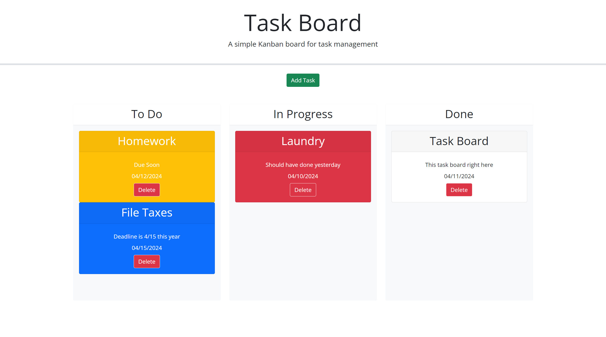

# README

## Description

This repository is made for the purpose of adding functionality to a task board.

## Visuals

## Usage

Click "Add Task" button to open modal window for entering task title, description, and due date.  Save to create task card.  Task cards are color coded by done, overdue, due soon, and due later.  Task cards can be dragged to To Do, In Progress, or Done columns or can be deleted with delete button.  All changes persist on reload.

## Technologies Used

HTML 5, CSS 3, Javascript ES6+

## Links

[Page Link](https://jtschams.github.io/task-board/)

[Repository link (Github)](https://github.com/jtschams/task-board)

[Author Github Profile](https://github.com/jtschams)

## Credits

jQuery: \
https://jquery.com/ \
v3.4.1

jQuery UI: \
https://jqueryui.com/ \
v1.13.1

Bootstrap: \
https://getbootstrap.com/ \
v5.1.3

Day.js: \
https://day.js.org/ \
v1.11.3

Font Awesome: \
https://fontawesome.com/ \
v5.8.1

Google Fonts: \
https://developers.google.com/fonts \

For Reset CSS: \
http://meyerweb.com/eric/tools/css/reset/ \
v2.0 | 20110126 \
License: none (public domain)
